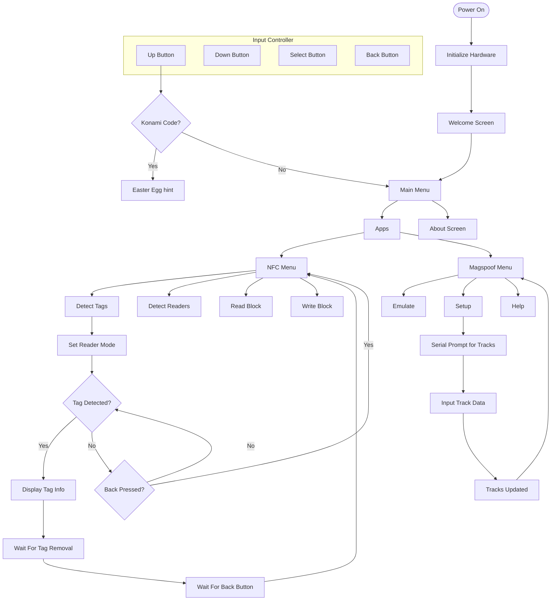

# REcon Badge 2025

This is the oficial repository of the REcon Badge 2025. Here you will find the source code for the badge, as well as the documentation and instructions to build it.

## Getting Started

Your badge comes with a pre-installed firmware, but in case you want to reprogram it, you can follow these steps:

1. Download the latest `firmware.uf2` file from the [releases](https://github.com/ElectronicCats/badge-recon-2025/releases/latest) page.

2. Connect the badge to your computer using a USB-C cable.

3. Press and hold the button on the badge while connecting it to the USB port. This will put the badge in bootloader mode.

4. Once the badge is connected, it will appear as a USB drive named `RPI-RP2`. Copy the `firmware.uf2` file to the root of the drive.

5. After copying the file, the badge will automatically reboot and start running the new firmware.

> **Note:** Sometimes you may need to press the reset button on the badge after copying the firmware file to ensure it starts correctly.

### Building the Firmware

To build the firmware from source, you will need to have [Docker](https://www.docker.com/) installed on your machine. Once you have Docker set up, you can follow these steps:

1. Clone the repository:

Using HTTPS:

```bash
git clone https://github.com/ElectronicCats/badge-recon-2025.git
```

Using SSH:

```bash
git clone git@github.com:ElectronicCats/badge-recon-2025.git
```

2. Navigate to the firmware directory:

```bash
cd badge-recon-2025/firmware
```

3. Build the firmware using Docker:

```bash
./build.sh
```

This script will create a `firmware.ino.uf2` file in the `firmware/build` directory.

> To flash the firmware to the badge, follow the same steps as mentioned in the "Getting Started" section, but use the newly built `firmware.ino.uf2` file instead of the pre-built one.

> If you find any issues, please open an issue on the GitHub repository.

## User guide

Your badge comes with an SSD1306 OLED display and 4 buttons for navigation. When you power on the badge, it will display a welcome screen and then show the main menu after you press any button.

All the available applications are listed in the following diagram:



### NFC Applications

- **Read Block** and **Write Block** applications are the same as **Detect Tags**, but they perform read and read/write operations if the detected tag is a Mifare Classic tag.
- **Detect Readers** allows you to detect NFC readers by emulating a tag.

### Magspoof Application

The **Magspoof** application allows you to emulate a magnetic stripe card.

- You can set up the tracks by entering the data through the serial prompt, use 9600 baud rate to communicate with the badge.
- The **Emulate** option allows you to emulate the magnetic stripe card with the configured tracks.

### Easter Egg

You can get a hint about the Easter egg by pressing the Konami code while the badge shows the REcon logo. The Konami code is:

```
Up, Up, Down, Down, Left, Right, Left, Right
```

## License

<a href="https://github.com/ElectronicCats">
    
</a>

Electronic Cats invests time and resources providing this open source design, please support Electronic Cats and open-source hardware by purchasing products from Electronic Cats!

Designed by Electronic Cats.

Firmware released under an GNU AGPL v3.0 license. See the LICENSE file for more information.

Hardware released under an CERN Open Hardware Licence v1.2. See the LICENSE_HARDWARE file for more information.

Electronic Cats is a registered trademark, please do not use if you sell these PCBs.
